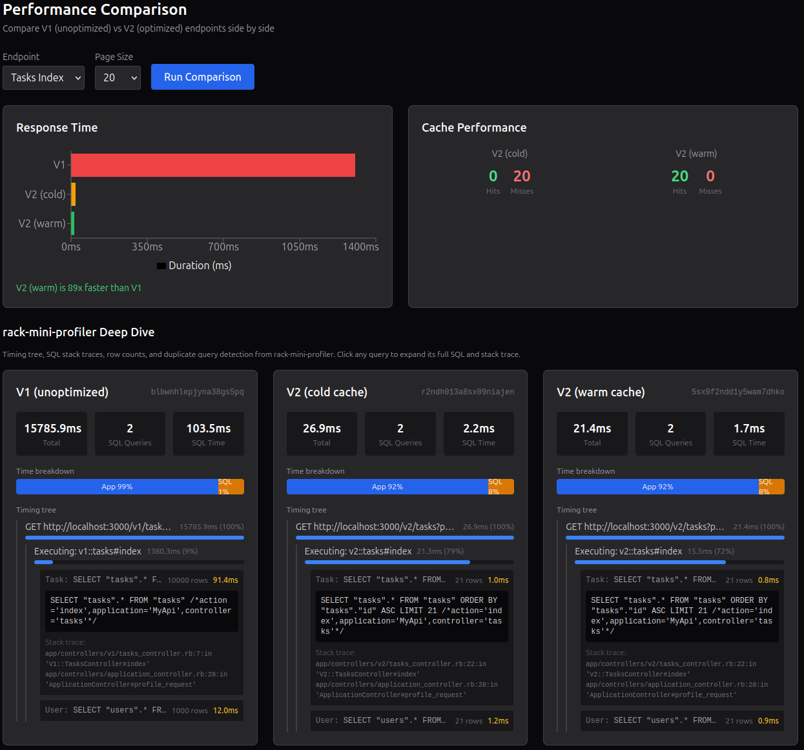

# Rails Perf Lab

A Rails API performance optimization showcase. The app exposes the same endpoints in two versions — V1 (unoptimized) and V2 (optimized) — with a React frontend that visualizes the performance differences



## Tech stack

- Ruby 3.4 / Rails 8.1 (API-only)
- PostgreSQL
- React + TypeScript + Vite
- Tailwind CSS + Recharts
- rack-mini-profiler, Bullet

## Setup

```bash
# Install dependencies
bundle install
cd frontend && npm install && cd ..

# Create and seed the database (1K users, 10K tasks, 5K comments)
bin/rails db:create db:migrate db:seed

# Enable caching in development
bin/rails dev:cache
```

## Running

```bash
# Terminal 1: Rails API
bin/rails server

# Terminal 2: React frontend
cd frontend && npx vite
```

Open `http://localhost:5173/`

## Endpoints

All endpoints are available under `/v1` (unoptimized) and `/v2` (optimized):

| Endpoint | Actions |
|---|---|
| `/tasks` | index, show, create, update, destroy |
| `/users` | index, show |
| `/users/:id/tasks` | index |

Append `?profile=true` to any request to get inline profiling data (duration, SQL queries, cache stats).

## Rate Limiting

Rack::Attack provides three throttle tiers:

| Rule | Limit | Purpose |
|---|---|---|
| General | 300 req / 5 min per IP | Baseline protection |
| Index endpoints | 60 req / 1 min per IP | Guards expensive collection queries |
| Writes | 30 req / 1 min per IP | Prevents abuse of POST/PATCH/DELETE |

Throttled requests receive a `429` JSON response with `Retry-After` and `X-RateLimit-*` headers. Suspicious paths (path traversal, `.php` probes) trigger an auto-ban via `Allow2Ban`.

## Benchmark

```bash
bin/rails perf:benchmark
```

Runs all endpoints against both V1 and V2 with cold/warm cache comparisons and prints a timing table.
